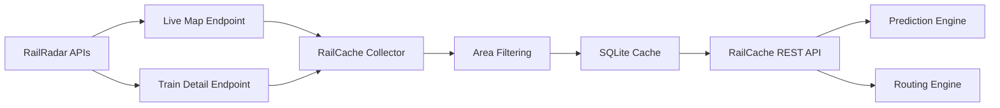
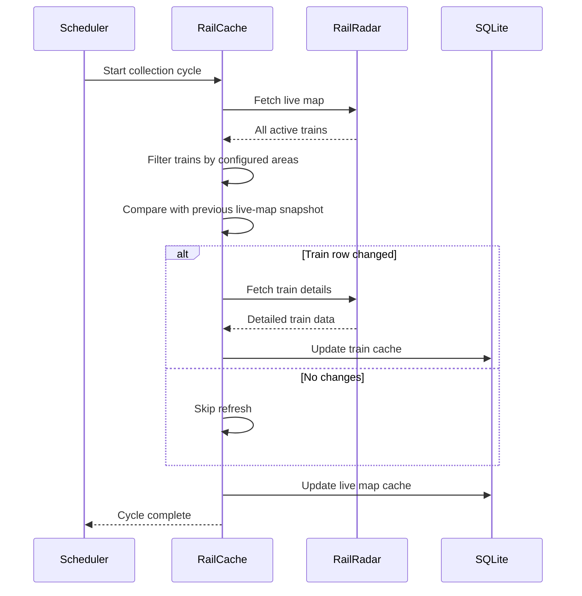

# RailCache

A high-performance railway data aggregation and caching service built with Bun and SQLite.

RailCache continuously collects live train movement data, intelligently detects updates, caches train metadata, and exposes a fast local API for downstream applications such as prediction engines and analytics systems.

---

## Problem

Live railway APIs often provide large datasets and require thousands of repeated requests to obtain detailed information about individual trains.

A typical workflow looks like:

1. Fetch all trains from a live map endpoint.
2. Filter trains of interest.
3. Query each train individually for detailed information.
4. Repeat continuously.

This creates several challenges:

* High API usage
* Slow response times
* Duplicate requests
* Difficult integration across multiple applications
* Poor scalability for analytics and prediction systems

---

## Solution

RailCache acts as a local railway intelligence layer.

Instead of every application directly contacting external APIs, a single collector continuously gathers and updates train information.

Applications then query RailCache through lightweight local endpoints.

Benefits:

* Reduced external API requests
* Faster response times
* Shared centralized cache
* Easy integration with multiple applications
* Foundation for future analytics and prediction systems

---

## System Architecture



### Collection Flow



### Why This Architecture?

Instead of allowing every application to directly query external railway APIs, RailCache centralizes collection and caching into a single service.

Benefits:

* Reduces duplicate external requests
* Improves response times
* Provides a single source of truth
* Enables future analytics and prediction systems
* Scales across multiple client applications

This architecture forms the data backbone for future railway intelligence products including prediction systems, delay analytics, congestion monitoring, and real-time passenger information platforms.


---

## Key Features

### Smart Change Detection

RailCache compares consecutive live-map snapshots and only refreshes train details when the source data changes.

This dramatically reduces unnecessary requests.

### Area-Based Filtering

Define geographic regions and track only trains operating inside those regions.

Example:

```json
{
  "name": "mumbai",
  "minLat": 18.8,
  "maxLat": 19.4,
  "minLng": 72.75,
  "maxLng": 73.15
}
```

### Local High-Speed Cache

Uses SQLite running locally inside Bun.

Benefits:

* Zero external database dependency
* Low memory usage
* Fast startup
* Simple deployment

### Continuous Collection

The collector runs continuously while preventing overlapping collection cycles.

Behavior:

* Target refresh interval: 5 seconds
* If collection finishes early, waits the remaining time
* If collection takes longer than 5 seconds, immediately begins the next cycle

### REST API

Provides cached train information without requiring direct access to upstream services.

---

## Endpoints

### Health Check

```http
GET /health
```

Returns collector health information.

### Live Map

```http
GET /live-map
```

Returns all cached trains.

### Area Live Map

```http
GET /areas/:area/live-map
```

Returns trains currently inside a configured area.

Example:

```http
GET /areas/mumbai/live-map
```

### Area Train Details

```http
GET /areas/:area/trains
```

Returns detailed train information for trains inside an area.

### Individual Train

```http
GET /train/:trainNumber
```

Example:

```http
GET /train/91001
```

---

## Technology Stack

* Bun
* TypeScript
* SQLite
* Chalk
* REST API

---

## Setup

### Requirements

* Bun 1.2+

### Install

```bash
bun install
```

### Configure Areas

Edit:

```text
src/config/areas.json
```

Example:

```json
[
  {
    "name": "mumbai",
    "minLat": 18.8,
    "maxLat": 19.4,
    "minLng": 72.75,
    "maxLng": 73.15
  }
]
```

### Run

```bash
bun run src/server.ts
```

or

```bash
bun run dev
```

---

## Project Structure

```text
src/

collector/
db/
routes/
services/
types/
utils/

server.ts
```

---

## Future Roadmap

* Historical train movement storage
* ETA prediction
* Delay prediction
* Congestion analysis
* Route replay
* Heatmaps
* Multi-region tracking
* Polygon-based geographic filtering
* Machine learning based forecasting

---

## Why We Built This

RailCache is designed as the data backbone for a larger railway intelligence ecosystem.

Instead of repeatedly querying external services from multiple applications, we centralize collection, caching, and distribution into a single efficient service.

This creates a scalable foundation for real-time monitoring, prediction, analytics, and user-facing railway products.

---

Built with Bun, TypeScript, and far too much curiosity about trains.
